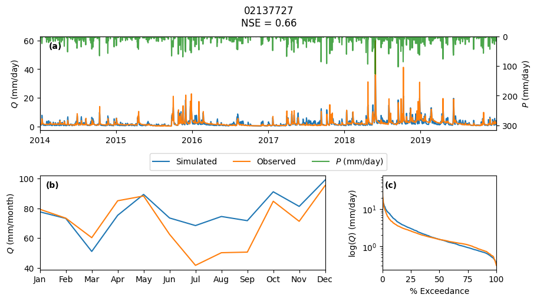

# Tutorials

The example notebooks have several additional dependencies that need to installed in
addition to `hysetter`. You can install all the dependencies using `micromamba` (or
`conda` or `mamba`) by downloading the `environment.yml` file from
[here](https://raw.githubusercontent.com/hyriver/hysetter/main/environment.yml) and
creating the environment using:

```bash
micromamba env create -f environment.yml
```

Alternatively, though not recommended, you can install the dependencies using `pip`:

```bash
python -m venv ./venv
source ./venv/bin/activate
pip install hysetter[dev]
```

If you use the `pip` method, you need to install `gdal` for your operating system,
following the instructions in the
[GDAL documentation](https://gdal.org/en/latest/download.html). It's recommended to
avoid using `pip` since it can be difficult to install `gdal` properly.

<div class="grid cards" markdown>

- [{ loading=lazy }](hymod.ipynb "Hydrological Modeling")
    **Hydrological Modeling**

</div>
