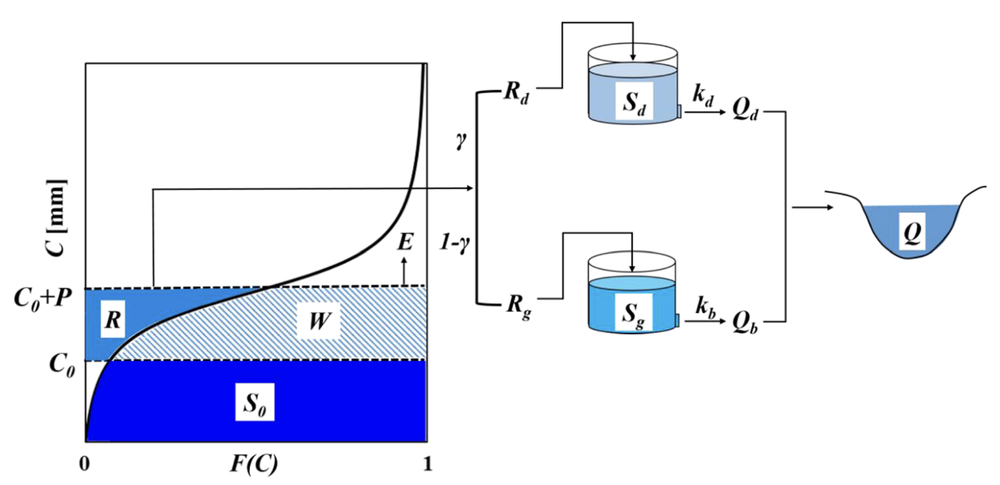

# Tutorials

The example notebooks have several additional dependencies that need to installed in
addition to `hysetter`. You can install all the dependencies using
[Pixi](https://pixi.sh/latest/). You can first install Pixi by following the
[installation instructions](https://pixi.sh/latest/installation/) for your platform.
Then, run the following command in the root of the repository:

```bash
pixi install -e dev
```

This will install all the dependencies needed to run the example notebooks in an
isolated environment under `./.pixi/envs/dev`. If you are using an IDE like
[VSCode](https://code.visualstudio.com/), it should automatically detect the
environment, so you can select it as the interpreter for the notebooks.

Alternatively, if you prefer to use `micromamba`, `conda`, or `mamba`, you can create a
new environment and install the dependencies from the `environment.yml` file provided in
the root of the repository. You can download this file from
[here](https://raw.githubusercontent.com/hyriver/hysetter/refs/heads/main/environment.yml),
then use the following command to create the environment:

```bash
conda env create -f environment.yml
```

This will create a new environment named `hysetter` with all the dependencies installed.

<div class="grid cards" markdown>

- [{ loading=lazy }](hymod.ipynb "HYMOD") **HYMOD**
- [{ loading=lazy }](ncrspdm.ipynb "NCRS-PDM")
    **NCRS-PDM**

</div>
